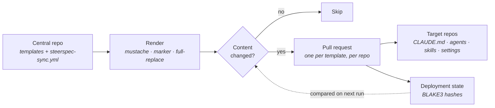

# SteerSpec Sync

> Define your AI configuration once. Ship it everywhere, by pull request.

<!-- markdownlint-disable MD013 -->
[](https://github.com/SteerSpec/strspc-sync/actions/workflows/ci.yml)
[](https://github.com/SteerSpec/strspc-sync/releases)
[](https://go.dev)
[](LICENSE)
[](https://github.com/marketplace/actions/steerspec-sync)
<!-- markdownlint-enable MD013 -->

Synchronize AI configuration files (`CLAUDE.md`, `.claude/agents/`, `.claude/skills/`,
`.claude/settings/`) across your GitHub organization. Define templates once in a central
repo, then distribute them via pull requests.

---

## How it works

Templates live in one central repo. On every run, `strspc` renders each template for each target
repository, hashes the result with BLAKE3, and compares it against the recorded deployment state.
Only genuine changes become pull requests — an unchanged render is skipped, so re-running is cheap
and quiet.



Nothing is force-pushed and nothing is merged for you: every change lands as a reviewable PR in the
target repo. Two companion commands watch what happens afterwards — `monitor` reports files that
have drifted away from their template, and `conflict` flags contradictions across the fleet.

## Quick Start

1. Create a central repo (e.g. `your-org/steerspec-config`)
2. Add a `steerspec-sync.yml` config and your templates (see [docs/quickstart/](docs/quickstart/) for examples)
3. Add a workflow to sync on push:

```yaml
name: SteerSpec Sync
on:
  push:
    branches: [main]
    paths:
      - 'templates/**'
      - 'steerspec-sync.yml'

jobs:
  sync:
    runs-on: ubuntu-latest
    steps:
      - uses: actions/checkout@v4
      - uses: SteerSpec/strspc-sync/sync@v1
        with:
          dry-run: false
        env:
          GITHUB_TOKEN: ${{ secrets.STEERSPEC_TOKEN }}
```

## Installation

### GitHub Action

Use the composite actions directly from the Marketplace:

```yaml
# Full action (specify command)
- uses: SteerSpec/strspc-sync@v1
  with:
    command: sync

# Convenience sub-actions
- uses: SteerSpec/strspc-sync/sync@v1
- uses: SteerSpec/strspc-sync/monitor@v1
- uses: SteerSpec/strspc-sync/conflict@v1
```

### CLI Binary

Download from [Releases](https://github.com/SteerSpec/strspc-sync/releases):

```bash
# macOS / Linux
curl -fsSL https://github.com/SteerSpec/strspc-sync/releases/latest/download/strspc_<version>_<os>_<arch>.tar.gz | tar xz
sudo mv strspc /usr/local/bin/
```

## Commands

### sync

Render templates and open PRs in target repositories.

```bash
strspc sync --config steerspec-sync.yml
strspc sync --config steerspec-sync.yml --dry-run
strspc sync --config steerspec-sync.yml --target-filter "my-org/api-*"
strspc sync --config steerspec-sync.yml --template-filter claude-md --force
```

**Action usage:**

```yaml
- uses: SteerSpec/strspc-sync/sync@v1
  with:
    dry-run: true
    target-filter: 'my-org/api-*'
```

**Outputs:** `prs-created`, `prs-updated`, `repos-skipped`, `errors`, `summary`

### monitor

Check target repositories for configuration drift and create issues.

```bash
strspc monitor --config steerspec-sync.yml
```

**Action usage:**

```yaml
- uses: SteerSpec/strspc-sync/monitor@v1
```

**Outputs:** `repos-in-sync`, `repos-drifted`, `issues-created`, `issues-closed`, `summary`

### conflict

Detect conflicts across AI configuration files in target repositories.

```bash
strspc conflict --config steerspec-sync.yml
strspc conflict --config steerspec-sync.yml --tiers 1,2
```

**Action usage:**

```yaml
- uses: SteerSpec/strspc-sync/conflict@v1
  with:
    tiers: '1,2'
```

**Outputs:** `conflicts-found`, `critical-count`, `warning-count`, `info-count`, `summary`

## Configuration

All configuration lives in `steerspec-sync.yml`.
See [docs/quickstart/steerspec-sync.yml](docs/quickstart/steerspec-sync.yml) for an example
and the [full specification](https://github.com/SteerSpec/strspc-spec/blob/main/rules/config/CONFIG.md)
for the schema reference.

## Contributing

Bug reports and pull requests are welcome — see [CONTRIBUTING.md](CONTRIBUTING.md) for the build,
test, and lint workflow. To report a security issue privately, see [SECURITY.md](SECURITY.md).

Pull requests to `main` are reviewed automatically by GitHub Copilot. When that review
comes back clean, [`pr-auto-approve`](https://github.com/SteerSpec/strspc-pr-review)
posts the approving review as `cnslr-bt`, which satisfies the required-approval rule — so
an approval from a bot you have never met is expected, not a misconfiguration.

It approves only when every check has passed and Copilot's latest review is clean for the
current commit. A push after Copilot reviewed dismisses the approval until Copilot
re-reviews, and `CHANGES_REQUESTED` always blocks.

## Related projects

Part of the [SteerSpec](https://steerspec.dev) ecosystem:

- [strspc-rules](https://github.com/SteerSpec/strspc-rules) — canonical rule format specification
- [strspc-manager](https://github.com/SteerSpec/strspc-manager) — core enforcement engine
- [strspc-CLI](https://github.com/SteerSpec/strspc-CLI) — render, validate, and manage rule files

## Specification

This tool implements the [SteerSpec Sync specification](https://github.com/SteerSpec/strspc-spec).

## License

Apache 2.0 -- see [LICENSE](LICENSE).
